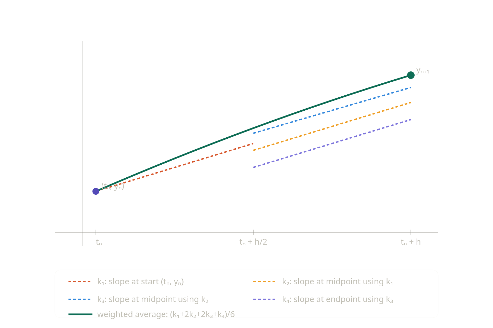

# Geodesics Around a Schwarzschild Black Hole

Integrate the geodesic equation in the Schwarzschild metric and trace photon and massive-particle paths near a non-rotating black hole. The project recovers the **photon sphere**, the **innermost stable circular orbit (ISCO)**, and **gravitational light bending**, and produces a Manim animation of particles spiraling inward.

The pipeline:

1. Derive the equations of motion from the Schwarzschild Lagrangian.
2. Integrate them numerically with RK4.
3. Store the trajectory data in HDF5.
4. Render an animation from the dataset with Manim.

---

## 1. Theoretical Background

### 1.1 The Schwarzschild Metric

In geometrized units the line element is

$$ds^2 = -\left(1 - \frac{2m}{r}\right)dt^2 + \frac{dr^2}{1 - \frac{2m}{r}} + r^2\,d\Omega^2,$$

with

$$m = \frac{GM}{c^2}, \qquad d\Omega^2 = d\theta^2 + \sin^2\theta\,d\phi^2.$$

The signature is $(-,+,+,+)$.

### 1.2 Killing Vectors and Conserved Quantities

A vector field $\xi^\mu$ is a **Killing vector** if the metric is invariant along its flow,

$$\mathcal{L}_\xi g_{\mu\nu} = 0. \qquad (1)$$

The Lie derivative of the metric can be written

$$\mathcal{L}_\xi g_{\mu\nu} = \left(\partial_\mu \xi^\alpha\right) g_{\alpha\nu} + \left(\partial_\nu \xi^\beta\right) g_{\mu\beta} + \xi^\rho\,\partial_\rho g_{\mu\nu},$$

and equation (1) is equivalent to the **Killing equation**

$$\nabla_\mu \xi_\nu + \nabla_\nu \xi_\mu = 0.$$

*Reminder.* The covariant derivative of a tensor is

$$\nabla_\gamma T^{\alpha_1\ldots\alpha_m}{}_{\beta_1\ldots\beta_n} = \partial_\gamma T^{\alpha_1\ldots\alpha_m}{}_{\beta_1\ldots\beta_n} + \sum_i \Gamma^{\alpha_i}_{\lambda\gamma} T^{\alpha_1\ldots\lambda\ldots\alpha_m}{}_{\beta_1\ldots\beta_n} - \sum_j \Gamma^{\lambda}_{\beta_j\gamma} T^{\alpha_1\ldots\alpha_m}{}_{\beta_1\ldots\lambda\ldots\beta_n},$$

so for a covector

$$\nabla_\mu \xi_\nu = \partial_\mu \xi_\nu - \Gamma^{\lambda}_{\mu\nu}\,\xi_\lambda.$$

Because the Schwarzschild components are independent of $t$ and $\phi$, the metric admits two Killing vectors, $\partial_t$ and $\partial_\phi$, with associated conserved quantities (per unit rest mass):

$$E = \left(1 - \frac{2m}{r}\right)\dot{t}, \qquad L = r^2\,\dot{\phi},$$

where $\dot{X} \equiv dX/d\tau$.

### 1.3 Lagrangian Derivation

Restricting motion to the equatorial plane $\theta = \pi/2$, $\dot\theta = 0$, the metric becomes

$$ds^2 = -\left(1 - \frac{2m}{r}\right)dt^2 + \frac{dr^2}{1 - \frac{2m}{r}} + r^2\,d\phi^2,$$

and the geodesic Lagrangian is

$$\mathcal{L} = \frac{1}{2}\,g_{\mu\nu}\,\dot{x}^\mu \dot{x}^\nu = \frac{1}{2}\left[-\left(1 - \frac{2m}{r}\right)\dot{t}^2 + \frac{\dot{r}^2}{1 - \frac{2m}{r}} + r^2 \dot{\phi}^2\right].$$

The Euler–Lagrange equation

$$\frac{d}{d\tau}\frac{\partial \mathcal{L}}{\partial \dot{q}} - \frac{\partial \mathcal{L}}{\partial q} = 0$$

applied to the cyclic coordinates $t$ and $\phi$ recovers the two conservation laws:

| Coordinate | $\partial\mathcal{L}/\partial \dot{q}$ | Conserved quantity |
|------------|----------------------------------------|--------------------|
| $t$        | $-(1 - 2m/r)\,\dot{t}$                 | $E = (1 - 2m/r)\,\dot{t}$ |
| $\phi$     | $r^2 \dot{\phi}$                       | $L = r^2 \dot{\phi}$ |

(The $t$ constant is defined as $-E$ so that $E > 0$ for physical trajectories.)

### 1.4 Equation of Motion

The 4-velocity normalization gives

$$g_{\mu\nu}\,\dot{x}^\mu \dot{x}^\nu = -\epsilon, \qquad \epsilon = \begin{cases} 1 & \text{massive particles (timelike, } \tau \text{ = proper time)} \\ 0 & \text{photons (null)} \end{cases}$$

In the equatorial plane this reads

$$-\left(1 - \frac{2m}{r}\right)\dot{t}^2 + \frac{\dot{r}^2}{1 - \frac{2m}{r}} + r^2 \dot{\phi}^2 = -\epsilon.$$

Substituting $\dot{t} = E/(1 - 2m/r)$ and $\dot{\phi} = L/r^2$ and rearranging:

$$\boxed{\;\dot{r}^2 = E^2 - \left(1 - \frac{2m}{r}\right)\left(\epsilon + \frac{L^2}{r^2}\right)\;} \qquad (2)$$

This has the form $\dot{r}^2 + V_\text{eff}(r) = E^2$ with the **effective potential**

$$V_\text{eff}(r) = \left(1 - \frac{2m}{r}\right)\left(\epsilon + \frac{L^2}{r^2}\right).$$

Differentiating (2) once with respect to $\tau$ removes the square root and gives the second-order radial equation

$$\boxed{\;\ddot{r} = -\frac{m\epsilon}{r^2} + \frac{L^2}{r^3} - \frac{3mL^2}{r^4}\;}$$

The last term is the **GR correction** absent from the Newtonian problem; it is responsible for perihelion precession, the photon sphere, and the ISCO.

### 1.5 Special Orbits

Circular orbits require $V_\text{eff}'(r) = 0$:

- **Photon sphere** ($\epsilon = 0$): $r_{ph} = 3m$. Unstable circular null orbit — the boundary of the black hole shadow.
- **Innermost Stable Circular Orbit** ($\epsilon = 1$): solving $V_\text{eff}'(r) = V_\text{eff}''(r) = 0$ gives $r_\text{ISCO} = 6m$. Inside this radius all circular orbits are unstable and any massive particle inevitably plunges.

### 1.6 The System to Integrate

Introducing $p_r \equiv \dot{r}$, the four first-order ODEs are

$$\frac{dr}{d\tau} = p_r, \qquad \frac{dp_r}{d\tau} = -\frac{m\epsilon}{r^2} + \frac{L^2}{r^3} - \frac{3mL^2}{r^4},$$

$$\frac{d\phi}{d\tau} = \frac{L}{r^2}, \qquad \frac{dt}{d\tau} = \frac{E}{1 - 2m/r}.$$

Initial conditions are chosen from $(r_0,\phi_0)$ together with values of $E$ and $L$ consistent with (2) at $\tau = 0$.

---

## 2. Numerical Method: Runge–Kutta 4

We have a first-order ODE $\dfrac{dy}{dt} = f(t,y)$ with known starting point $(t_0,y_0)$ and want $y$ at later times with step size $h$. Euler's method just follows the slope at the current point and drifts off the true curve quickly. RK4 samples the slope four times across each interval and takes a weighted average; it has **local error $O(h^5)$** and **global error $O(h^4)$**.

The four slope samples are

$$k_1 = f(t_n,\,y_n) \quad\text{— slope at the start}$$

$$k_2 = f\!\left(t_n + \tfrac{h}{2},\; y_n + \tfrac{h k_1}{2}\right) \quad\text{— midpoint slope predicted from }k_1$$

$$k_3 = f\!\left(t_n + \tfrac{h}{2},\; y_n + \tfrac{h k_2}{2}\right) \quad\text{— midpoint slope predicted from }k_2$$

$$k_4 = f\!\left(t_n + h,\; y_n + h k_3\right) \quad\text{— endpoint slope predicted from }k_3$$



The update is

$$y_{n+1} = y_n + \frac{h}{6}\,(k_1 + 2k_2 + 2k_3 + k_4).$$

### Why the weights $1, 2, 2, 1$?

The exact solution by Taylor expansion is

$$y(t_n + h) = y_n + h y' + \tfrac{h^2}{2} y'' + \tfrac{h^3}{6} y''' + \tfrac{h^4}{24} y^{(4)} + O(h^5),$$

and any RK4-style update $y_{n+1} = y_n + h\,(b_1 k_1 + b_2 k_2 + b_3 k_3 + b_4 k_4)$ should agree with this expansion through order $h^4$.

Formally integrating $y' = f(t,y)$ from $t_n$ to $t_n + h$ and substituting $t = t_n + sh$,

$$y(t_n + h) - y(t_n) = h \int_0^1 f(t_n + sh,\,y(t_n + sh))\,ds.$$

Simpson's rule for any smooth $g$ states

$$\int_0^1 g(s)\,ds = \frac{1}{6}\,\bigl[\underbrace{g(0)}_{\text{start}} + 4\underbrace{g(1/2)}_{\text{middle}} + \underbrace{g(1)}_{\text{end}}\bigr].$$

RK4 estimates the midpoint slope $f_\text{mid} = f(t_n + h/2,\,y(t_n + h/2))$ twice — as $k_2$ and $k_3$ — so Simpson's coefficient of $4$ is split as $2 + 2$. That gives the familiar weights $\{1, 2, 2, 1\}/6$.

---

## 3. Pipeline

1. **Integrator (C).** `main.c` integrates a bundle of geodesics with RK4 in the affine parameter $\lambda$ (= proper time $\tau$ for massive particles). One state vector per orbit: $(r, p_r, \phi, t)$. Each orbit has its own step budget so bound orbits stop after a few periods while ring photons can wind for $10^5$ steps.
2. **Dataset (HDF5).** Trajectories are written to `geodesic.h5`, one group per orbit, with full metadata as attributes (see schema below).
3. **Animation (Python).** `animation.ipynb` reads `geodesic.h5` and renders an in-notebook animation with matplotlib `FuncAnimation`. Each particle is drawn as a coloured dot with a short fading trail; the horizon, photon sphere, and ISCO are drawn as reference circles.

### Orbit menu

The `orbits[]` table in `main.c` mixes 24 trajectories chosen to demonstrate the qualitatively distinct regimes:

| Count | Kind | What it shows |
|---|---|---|
| 5 | bound massive (`L > 2\sqrt{3}\,M$`) | perihelion precession (rosettes) |
| 1 | near-ISCO massive | tightly precessing orbit just outside $r_\text{ISCO}$ |
| 2 | radial plunge ($L = 0$) | straight infall through the horizon |
| 3 | photon with $b \ll b_\text{crit}$ | direct capture |
| 4 | photon with $b$ just below $b_\text{crit}$ | wind near $r = 3M$, then plunge |
| 4 | photon with $b$ just above $b_\text{crit}$ | wind near $r = 3M$, then escape |
| 5 | photon with $b \gg b_\text{crit}$ | small-angle gravitational lensing |

The ring photons sit at $b_\text{crit} \pm \{10^{-2}, 10^{-3}, 10^{-5}, 10^{-7}\}$. The number of windings near the photon sphere goes like $-\ln|b - b_\text{crit}|$, so the $10^{-7}$ offsets give roughly three full loops before the photon peels off. Pushing closer than $10^{-9}$ runs into the double-precision floor.

### HDF5 schema

```
geodesic.h5
├── /                         (attrs: M, r_horizon, r_isco, r_photon, b_crit, n_orbits)
├── orbit_000/                (attrs: epsilon, E, L, r0, phi0, p_r0, kind, fate)
│   ├── lambda   (1D, n)
│   ├── r        (1D, n)
│   ├── phi      (1D, n)
│   ├── x, y     (Cartesian, for plotting)
│   └── t        (Schwarzschild coordinate time)
├── orbit_001/  ...
└── orbit_023/
```

- `epsilon` (int): 1 = massive, 0 = photon.
- `kind` (string): `massive_bound`, `massive_near_isco`, `massive_plunge`, `photon_capture`, `photon_escape`. Used by the animation script to pick a colour without hardcoding orbit indices.
- `fate` (string): `captured`, `escaped`, or `timeout` — the loop exit reason. Self-describing for downstream filtering.

### Build & Run

```bash
gcc -O3 -march=native main.c -o schwarzschild $(pkg-config --cflags --libs hdf5) -lm
./schwarzschild
```

`-O3` enables auto-vectorization of the RK4 inner loop and `-march=native` lets gcc emit AVX/AVX2 for your CPU. Avoid `-ffast-math` — the integrator approaches $r \to 2m$ where $1/(1 - 2m/r)$ diverges, and you want IEEE semantics to catch it.

Expected output:
```
Orbits: 24 total (8 massive, 16 photons)
[/orbit_000] timeout  lambda = 1000, n = 2001
...
[/orbit_015] escaped  lambda = 120.5, n = 241
...
Wrote 24 orbits to geodesic.h5
```

### Animation

Open `animation.ipynb` in Jupyter (with the same env that has `h5py`, `matplotlib`, `numpy`).

`HTML(anim.to_jshtml())` embeds a JS player directly in the notebook — no ffmpeg required. To export an MP4:

```python
anim.save("animation.mp4", fps=25, dpi=120)
```